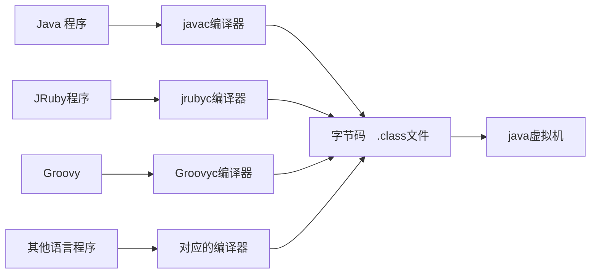

+ 实现语言无关性的基础仍然是虚拟机和字节码存储格式。Java虚拟机不和包括Java在内的任何语言绑定，它只与"Class文件"这种特定的二进制文件格式所关联
+ 作为一个通用的、机器无关的执行平台，任何其他语言的实现者都可以将java虚拟机作为语言的产品交付媒介
+ 字节码命令所能提供的语义描述能力肯定会比java语言本身更加强大，因此，有一些java语言本身无法有效支持的语言特性不代表字节码本身无法有效支持

