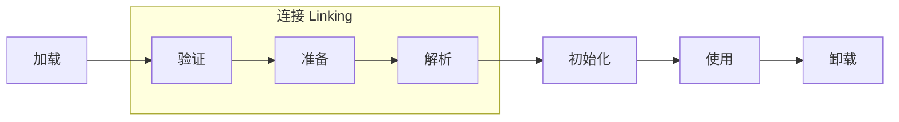

### 7.1 概述

- 虚拟机把描述类的数据从Class文件加载道内存，并对数据进行校验、转换解析和初始化，最终形成可以被虚拟机直接使用的Java类型，这就是虚拟机的类加载机制
- java语言的类型加载、连接和初始化都是在运行期完成的，虽然这样会带来性能开销，但也提高了java的灵活性。
- java可以动态扩展的语言特性就是依赖运行期动态加载和动态连接的特点实现的。

### 7.2 类加载的时机

- 类从被加载到虚拟机内存中，到卸载出内存，它的整个生命周期包括：加载、验证、准备、解析、初始化、使用和卸载7个阶段。验证，准备，解析3个部分统称为连接

- 其中，加载、验证、准备、初始化、卸载5个步骤的顺序是固定的。而解析阶段却不一定，这是为了支持java语言的运行时绑定(也称动态绑定或晚期绑定)
- 加载开始的时机没有强制约束，但初始化阶段有要求，**有且只有**5种情况**必须**对类初始化
  1. 遇到new getstatic pustatic invokestatic这4条字节码指令时：
     - 使用new实例化对象
     - 读取或设置一个类的静态字段(被final修饰的除外)
     - 调用一个类的静态方法时
  2. 使用java.lang.reflect包的方法对类进行反射调用时
  3. 初始化一个类时，发现它的父类还没初始化时，要先初始化父类
  4. 虚拟机启动时先初始化主类(含main方法的类)
  5. JDK1.7动态语言支持时，如果一个java.lang.MethodHandle实例最后的解析结果REF_getStatic REF_putStatic REF_invokeStatic的方法句柄，并且这个方法句柄所对应的类没有进行过初始化，则需要先触发其初始化
- 以上5种称为对一个类的主动引用。此外，所有引用类的方式都不会触发初始化，称为被动引用，例如：
  - 通过子类引用父类的静态字段，不会导致子类初始化
  -  通过数组定义来引用类，不会触发此类的初始化
  - 常量在编译运行阶段会存入调用类的常量池中，本质上并没有直接引用到定义常量的类，因此不会触发定义常量的类的初始化
- 接口与类的真正有所区别是主动引用第三种：
  - 当一个类在初始化时，要求其父类必须全部初始化过
  - 但接口在初始化时，并不要求父接口全部完成初始化，只有在真正用到父接口时(如引用接口中定义的常量)，才会初始化