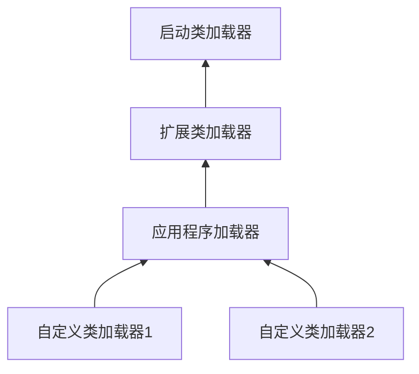

## 7.4 类加载器

+ 类加载过程中的“通过一个类的全限定名来获取描述此类的二进制字节流”这个动作被放到了java虚拟机外部来实现。实现这个动作的模块就叫**类加载器**
+ 类加载器是java语言流行的一大原因

### 7.4.1 类与类加载器

+ 类加载器只用于实现类的加载动作。但还用于表示类的唯一性：比较两个类是否“相等”，必须要在这两个类是被同一个类加载器加载的前提下才有意义
+ 这里的“相等”，包括代表类的class对象的equals()方法、isAssignableFrom()方法、isInstance()方法的返回结果，也包括使用instanceof关键字做对象所属关系判定等情况

### 7.4.2 双亲委派模型

+ 从开发角度将类加载器分为3类：
  + 启动类加载器(Bootstrap ClassLoader)
  + 扩展类加载器(Extension ClassLoader)
  + 应用程序类加载器(Application ClassLoader)
+ 双亲委派模型要求除了顶层的启动类加载器之外，其他类加载器都有父类加载器，父子关系不是继承，而是通过**组合(composition)**来复用父加载器的代码

+ 双亲委派模型的工作过程：如果一个类加载器收到了类加载的请求，它不会自己尝试加载，而是让父亲加载，递归到最上面的启动类加载器。如果父类加载不了，再一层层向下由子类解决
+ 好处是：java类随着它的类加载器一起具有了一种带有优先级的层次关系

### 7.3.4 破坏双亲委派模型

+ 双亲委派模型只是java推荐的模式，但历史上有三次被破坏的先例
+ 第一次是JDK1.2，双亲委派模型出现之前，为了兼容过去的问题
+ 第二次是JNDI服务，为了它，提出了线程上下文加载器，破坏了双亲委派
+ 第三次是代码热替换，模块热部署等对动态性的追求导致的