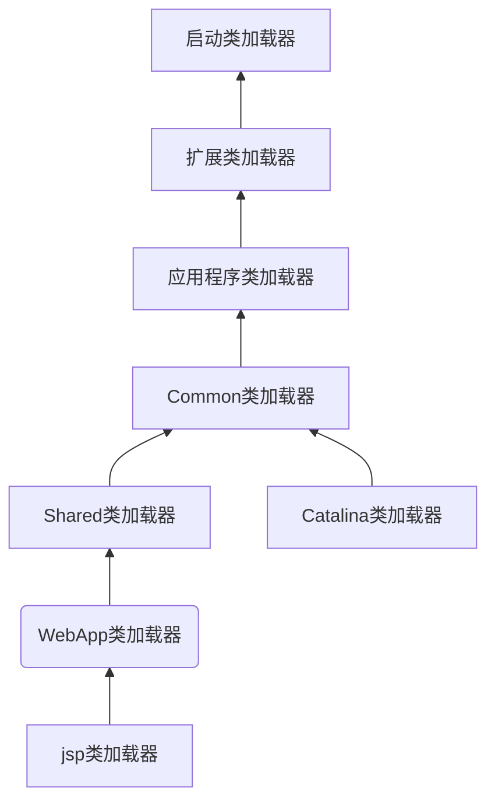

## 9.1概述

+ class文件格式与执行引擎这部分里，用户的程序能直接影响的内容并不多，能通过程序进行操作的，主要是字节码生成和类加载器这两部分

## 9.2 案例分析

### 9.2.1 Tomcat：正统的类加载器架构

+ 主流的java wenb服务器都实现了自己定义的类加载器，因为：
  + 部署在同一个服务器上的两个web应用程序所使用的java类库可以实现相互隔离
  + 部署在同一个服务器上的两个web应用程序所使用的java类库可以互相共享
  + 服务器需要尽可能地保证自身的安全不受部署的web应用程序影响
  + 支持JSP应用的web服务器，大多数都需要支持HotSwap功能
+ tomcat服务器的类加载架构如下图：

+ 其中webapp类加载器和jsp加载器会存在多个实例，每个web应用程序对应一个webapp类加载器，每个jsp文件对应一个jsp类加载器
+ jsp类加载器的加载范围仅仅是这个文件，一旦jsp文件被修改，就会替换掉当前的jsp类加载器实例，生成一个新的jsp类加载器来实现jsp文件的hotswap
+ tomcat6之后，common，catalina和shared三个目录合并，得到一个/lib目录

### 9.2.2 OSGi：灵活的类加载器架构

+ OSGi中的模块称为**Bundle**，和普通的java类库区别不大，都已JAR格式封装，内部都存储java package和class
+ 但Bundle可以声明它所依赖的和所能导出的package。这样，把传统的上层模块依赖底层模块转变为平级模块之间的依赖。
+ Bundle的类加载器架构很灵活，只有规则，没有固定的委派关系，规则如下：
  + 以java.*开头的类，委派给父类加载器加载
  + 否则，委派列表名单内的类，委派给父类加载器加载
  + 否则，import列表中的类，委派给其他export了这个累的bundle的类加载器加载
  + 否则，查找当前bundle的classpath，自己加载
  + 否则，查找是否在自己的fragment bundle中，委派给fragment bundle的类加载器加载
  + 否则，查找dynamic import列表的bundle，委派给对应bundle的类加载器加载
  + 类查找失败
+ OSGi里面，双亲委派的树形结构被破坏，转变成了网状结构，更灵活但也有可能出现死锁。

### 9.2.3 字节码生成技术与动态代理的实现

+ 看不懂，神仙代码，下一题

### 9.2.4 Retrotranslator：跨越JDK版本

+ retrotranslator的作用是将JDK1.5编译出来的Class文件转变为可以在JDK1.4或1.3上部署的版本。
+ java每次升级新增的功能大概可以分为4类
  + 在编译器层面做的改进。如自动装箱拆箱，变长参数，泛型等
  + 对java API的代码增强
  + 需要在字节码中进行支持的改动，比如1.7的invokedynamic字节码
  + 虚拟机内部的改进，比如CMS收集器的改动，新定义的java内存模型等
+ retrotranslator只能模拟前两类