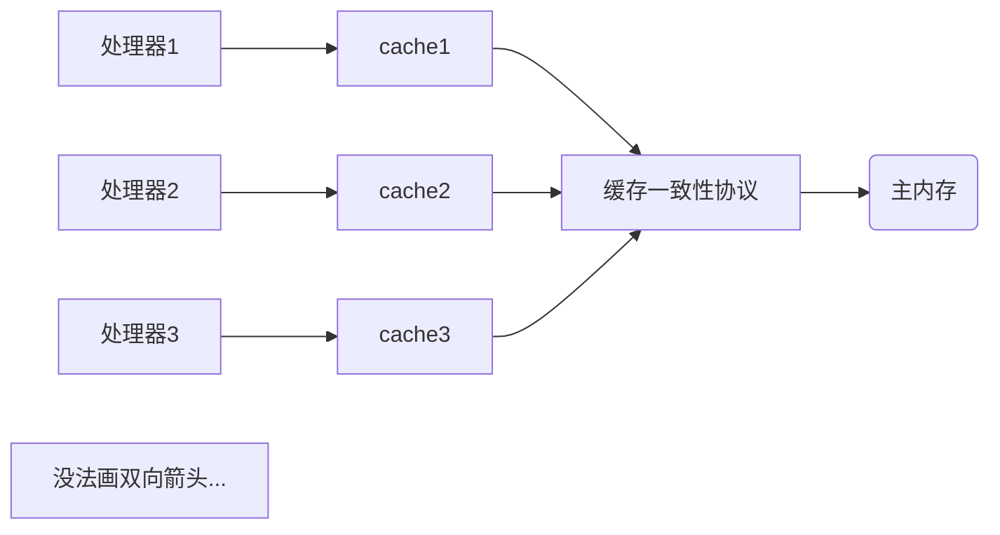

## 12.1 概述

+ 一个服务端同时对多个客户端提供服务是一个具体的并发应用场景
+ 衡量一个服务性能的高低好坏，**每秒事务处理数(TPS)**是最重要的指标之一

## 12.2 硬件的效率与一致性

+ 多核心的处理器虽然提高了速度，但多核心多个cache单一主内存的模式带来了**内存一致性**问题。
+ 为了解决这一问题，需要各个处理器访问缓存时遵循一些协议，如下图

+ 除了cache之外，为了充分利用cpu，处理器对输入代码进行**乱序执行**，完了再拼起来，java虚拟机也这样干的：**指令重排序**

