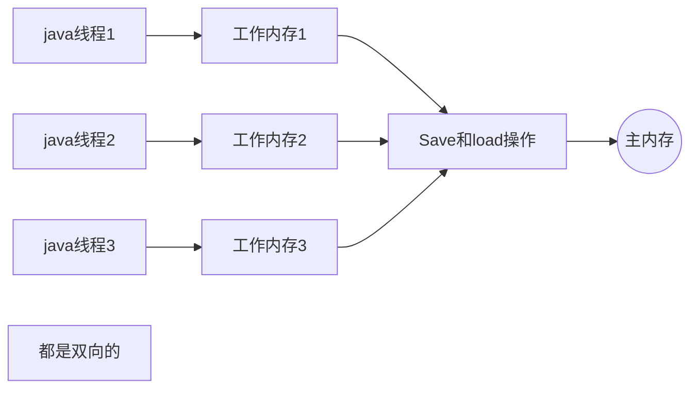

## 12.3 java 内存模型

+ 定义了一种**java内存模型(JMM)**来屏蔽掉各种硬件和操作系统的内存访问差异，以实现让java程序在各种平台下都能达到一致的内存访问效果

### 12.3.1 主内存与工作内容

+ jmm的主要目标是定义程序中各个**变量**的访问规则。此处的变量包括了**实例字段、静态字段和构成数组对象的元素**，但不包括**局部变量与方法参数**，因为后者是线程私有的。
+ jmm规定了所有的变量都存储在**主内存**，每个线程都有自己的**工作内存**，工作内存中保存了被该线程使用到的变量的主内存副本拷贝
+ 线程只能读写工作内存，不能直接读写主内存。如下图：

### 12.3.2 内存间交互操作

+ java内存模型定义了8种**原子操作**

| 操作   | 作用域         | 作用                                       |
| ------ | -------------- | ------------------------------------------ |
| lock   | 主内存中的变量 | 把一个变量标识为线程独占                   |
| unlock | 主内存         | 释放一个锁定状态的变量                     |
| read   | 主内存         | 把一个变量的值从主内存传输到线程的工作内存 |
| load   | 工作内存       | 把read操作得到的变量值放入工作内存的副本中 |
| use    | 工作内存       | 把工作内存中的变量值传递给执行引擎         |
| assign | 工作内存       | 把执行引擎返回的值赋给工作内存的变量       |
| store  | 工作内存       | 把工作内存中变量的值传送到主内存中         |
| write  | 主内存         | 把从工作内存中得到的变量值放入主内存中     |

+ 原子操作之外，还有几种执行原子操作的规则：
  + 不允许read和load、store和write操作之一单独出现，可以不连续，但必须成对(读了就得写)
  + 不允许一个线程丢弃assign操作：在工作空间中改变的变量，必须同步回主内存(改过必须存)
  + 没发生过assign操作时，不允许把工作内存中的数据同步回主内存(没改过你存嘛存)
  + 新内存只能在主内存诞生：对一个变量实施use、store操作前，必须先执行过assign、load
  + 一个变量同时只能被一条线程lock，但可以lock多次，多次lock后也要相应unlock多次
  + 对一个变量执行lock，会清空工作内存中此变量的值，想再使用的话，必须得重新执行load或assign操作初始化变量的值(别人改过的你肯定的重新读啊)
  + 不能unlock一个没被lock的变量
  + unlock一个变量时，先要把它同步回主内存(store,write)

### 12.3.3 对于volatile变量的特殊规则

+ 关键字volatile是java中最轻量级的同步机制
+ volatile修饰的变量有两种特性：
  + 第一：保证此变量对所有线程的**可见性**(不用等同步回主内存，其他线程都就知道这个变量的值了)，但也仅限于可见性。所以，在不满足以下两条规则的场景中，还得加锁：
    + 运算结果不依赖当前变量的当前值，或能够确保只有单一的线程修改变量的值
    + 变量不需要和其他的状态变量共同参与不变约束
  + 第二：禁止指令重排序优化
    + 优化后，java中的指令是乱序执行的，不加volatile，可能导致逻辑时间顺序产生bug
    + 观察汇编代码，发现volatile实现目的的方式是在最后加一个lock addl $0x0(%esp)操作，相当于对cache中的变量做了一次store和write操作，通过这样的空操作，可以让前面volatile变量的修改对其他cpu立刻可见
  + volatile有定义特殊规则：
    + use必须紧邻load和read，保证使用前先刷新，使用到的是最新的值
    + assign必须紧邻store和write，算出来立刻存。
    + 。。。说不清，太碎了，总之就是用来保证不会被指令重排序优化的。

### 12.3.4 对于long和double型变量的特殊规则

+ 虽然虚拟机规范不要求实现64位数据的原子性，将他们看做两个32位来操作。但虚拟机的实现一般都实现成原子的。

### 12.3.5 原子性、可见性与有序性

+ 原子性不用多说
+ 可见性是指：当一个线程修改了共享变量的值，其他线程能够立刻得知这个修改，实现可见性的关键字除了volatile，还包括synchtonized和final
  + synchtonized实现可见性是基于：*对一个变量执行unlock操作前，必须先将其同步回主内存* 来实现的
  + final则是在构造器中构造完成后，就能被所有线程共享
+ 有序性：java程序中天然的有序性用一句话来概括：**如果在本线程观察，所有的操作都是有序的；在一个线程中观察另一个线程，所有的操作都是无序的**
  + 前半句是指：线程内表现为串行的语义
  + 后半句是指：指针重排序 和 工作内存与主内存同步延迟现象
+ synchronized在三种特性中都很万能

### 12.3.6 先行发生原则

+ 先行发生原则不是时间上或代码次序上的先后，而是一些规则的组成：
  + **程序次序规则**：在**一个线程内**，按控制流顺序，前面的优先于后面的
  + **管程锁定原则**：一个Unlock操作先行发生于后面对同一个锁的lock
  + **volatile变量规则**：写一个volatile变量线性发生于后面(时间上)对这个变量的读操作
  + **线程启动规则**：Thread对象的start()方法现行发生于此线程的每一个动作
  + **线程终止规则**：线程中所有操作先行发生于现成的终止操作
  + **线程中断操作**：对线程interrupt()方法的调用先行发生于被中断线程的代码检测到中断事件的发生
  + **对象终结规则**：一个对象的初始化完成(构造函数执行结束)先行发生于它的finalize()方法的开始
  + **传递性**：如果操作A先行于B，B先行于C，则A先行于C
+ 结论：时间先后顺序与先行发生原则之间没有大关系，所以衡量并发安全问题时，不要受时间顺序干扰，一切必须以先行发生原则为准