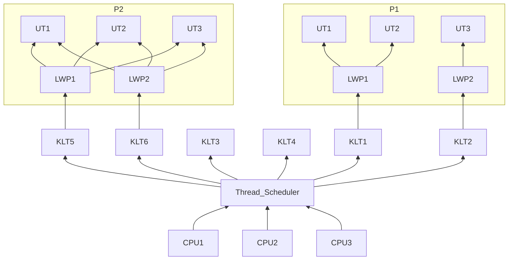
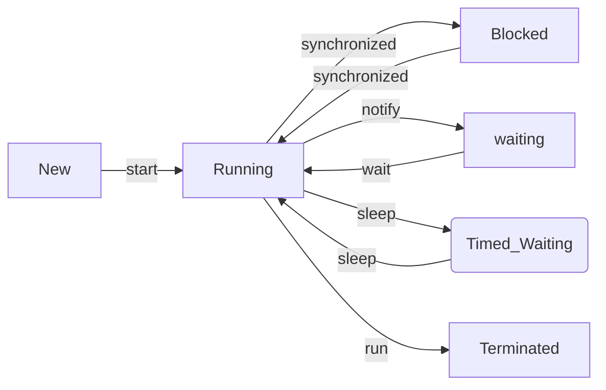

## 12.4 java与线程

### 12.4.1 线程的实现

+ java中的线程多是调用native的线程

+ 实现线程主要有三种方式：**使用内核线程实现**，**使用用户线程实现**，**使用用户线程加轻量级进程混合实现**

  1. 使用内核线程实现

     + 内核线程(KLT)就是直接由操作系统内核支持的线程

     + 程序一般使用的是内核线程的一种高级接口——**轻量级进程**(LWP)，也就是我们通常提到的线程

     + 这种轻量级进程与内核线程之间的关系是1:1的

     + 局限性：

       + 基于内核线程实现，因此需要很多系统调用，用户态和内核态频繁切换，代价较高

       ```mermaid
       graph BT
       	CPU1-->A[Thread_Scheduler]
       	CPU2-->A
       	CPU3-->A
       	A-->D1[KLT1]
       	A-->D2[KLT2]
       	A-->D3[KLT3]
       	A-->D4[KLT4]
       	A-->D5[KLT5]
       	A-->D6[KLT6]
       	subgraph P1
       	B1[LWP1]-->C1[P1]
       	B2[LWP2]-->C1[P1]
       	B3[LWP3]-->C1[P1]
       	end
       	subgraph P2
       	B4[LWP1]-->C2[P2]
       	B5[LWP2]-->C2[P2]
       	end
       	D1-->B1
       	D2-->B2
       	D3-->B3
       	D5-->B4
       	D6-->B5
       	
       ```

       

  2. 使用用户线程实现

     + 完全建立在用户空间上的线程，实现复杂

     + 已经很少用了

  3. 使用用户线程加轻量级进程混合实现

     + 用户线程的操作还在用户空间，依旧廉价
     + 轻量级进程则作为用户线程和内核线程的桥梁
     + 可以使用内核提供的线程调度和处理器映射，也降低了整个进程被完全阻塞的风险
     + 混合模式中轻量级进程和内核线程的关系是1:1的，用户线程和轻量级进程则是N:M的



### 12.4.2 java线程调度

+ 线程调度指系统为线程分配处理器使用权的过程，调度方式主要有两种：
  + 协同式线程调度：线程执行完后，主动通知系统切换线程
    + 好处是简单，缺点是线程执行时间不可控(它不放你就不好收回来)
  + 抢占式线程调度：每个线程将由系统来分配执行时间，大家抢时间片
    + 好处是执行时间可控

### 12.4.3 状态转换

+ java定义了五种线程状态，任意时间点，一个线程只能具有其中的一种状态：
  + 新建(new)：创建后尚未启动的状态
  + 运行(runable)：包括running和ready，也就是可执行状态
  + 无限期等待(waiting)：不会被分配cpu时间，要等待被其他线程显式唤醒
  + 限期等待(Timed waiting)：不会被分配CPU时间，但无需等待其他线程唤醒，由系统唤醒，例如thread.sleep()
  + 阻塞(Blocked)：线程被阻塞，“阻塞状态”在等待一个**排他锁**，等其他线程放弃这个锁的时候再进入runable
  + 结束(Terminated)：已结束执行
  + 相互转化如下图：



### 12.5 本章小结

+ 首先了解了jmm的结构和操作，然后讲解了原子性、可见性、有序性在jmm中的体现，最后介绍了先行发生原则的规则及使用
+ 还了解了线程在java中的实现