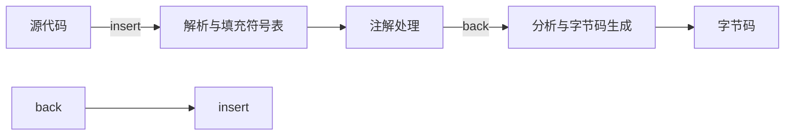

## 10.1 概述

+ 编译器分两段：
  + 前端编译器：把\*.java文件转变为\*.class文件
  + 后端编译器(JIT编译器，just in time compiler)：把字节码转变为机器码
+ 还有一种是**静态提前编译器**(AOT编译器，ahead of time compiler)：直接把\*.java文件编译称本地机器代码
+ 列举一下：
  + 前端：sun的javac、eclipse JDT中的增量式编译器(ECJ)
  + JIT编译器：hotspot VM的C1，C2编译器
  + AOT编译器：GNU Compiler for the java(GCJ)、Excelsior JET
+ javac对代码的**运行效率**几乎没有任何优化，**性能的优化**被集中到了后端的**即时编译器**中
+ java中即时编译器在运行期的优化影响程序运行，前端编译器在编译期的优化影响程序编码

## 10.2 javac编译器

### 10.2.1 javac的源码与调试

+ javac是纯粹由java写成的
+ javac的编译过程如下图

### 10.2.2 解析与填充符号表

+ 解析步骤由parseFiles()方法完成，解析步骤包括经典程序编译原理中的词法分析和语法分析两个过程

1. 词法、语法分析
   + **词法分析**是将源代码的字符流转变为**标记(token)**集合，标记是编译过程的最小元素。关键字、变量名、字面量、运算符都可以成为标记。
   + 源码中，词法分析由com.sun.tools.javac.parser.Scanner类实现
   + **语法分析**是根据token序列构造抽象语法树的过程。
   + **抽象语法树(AST)**用来描述程序代码的语法结构，每个节点代表代码中的一个**语法结构**，例如，包、类型、修饰符、运算符、结构、返回值、注释
   + 语法分析由com.sun.tools.javac.parser.parser类实现，产出的抽象语法树由com.sun.tools.javac.tree.JCTree类表示
   + 此步骤之后，编译器不在操作源码，而只操作抽象语法树了

2. 填充符号表
   + **符号表(Symbol table)**是由一组符号地址和符号信息构成的表格
   + 语义分析中，符号表将用于**语义检查**和**产生中间代码**
   + 在目标代码生成阶段，当对符号名进行地址分配时，符号表是地址分配的依据

### 10.2.3 注解处理器

+ 插入式注解处理器可以被视作一组编译器的插件，插件中可以读取修改添加抽象语法树中的任意元素。如果在处理注解期间修改了语法树，编译器就回到解析及填充符号表的过程重新处理。一圈又一圈。

### 10.2.4 语义分析与字节码生成

+ **语义分析**是对结构上正确的源程序进行上下文有关性质的审查，如类型审查等
+ java编译过程中，语义分析分两个步骤：**标注检查**和**数据及控制流分析**

1. 标注检查
   + 检查的内容包括变量使用前是否声明、变量与赋值之间的数据类型是否能匹配等
   + 还包括**常量折叠**步骤，对语句,int i = 1+2;，编译后直接折叠成int i = 3; 运行期间不占用cpu额外的指令

2. 数据及控制流分析
   + 对程序上下文逻辑进一步进行验证。可以检查：程序变量使用前是否有赋值，方法的每条路径是否都有返回值，是否所有的受查异常都被正确处理
   + 局部变量在常量池中没有引用，class文件中不可能知道一个局部变量是不是final，因此，将局部变量声明为final对运行期没有影响，变量的不变性仅仅由编译器在编译期间保障

3. 解语法糖
   + 语法糖(Syntactic sugar)，指在计算机语言中添加的某种语法，其对语言的功能没有影响，但更方便程序员使用
   + 使用语法糖可以提高程序的可读性，减少程序代码出错的机会
   + java属于低糖语言，最常用的语法糖是：**泛型、变长参数、自动装箱/拆箱**，虚拟机运行时不支持这些语法，它们在编译阶段还原会简单的基础语法结构，这个过程称为**解语法糖**

4. 字节码生成
   + 字节码生成阶段不仅仅是把前面各个步骤所生成的信息(语法树、符号表)转化成字节码写到磁盘里，编译器还进行了少量的代码添加和转换工作
   + 完成对语法树的遍历和调整之后，把填充了所有所需信息的符号表交给som.sun.tools.javac.jvm.ClassWriter类，输出字节码生成最终的class文件