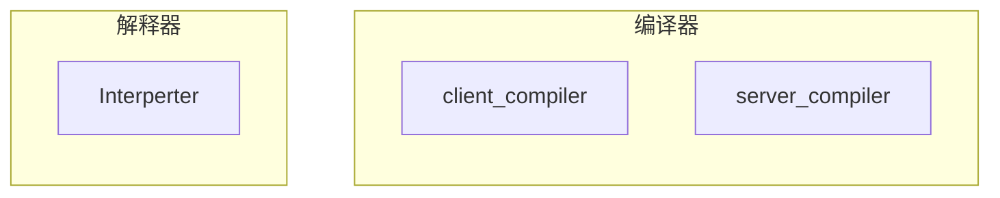
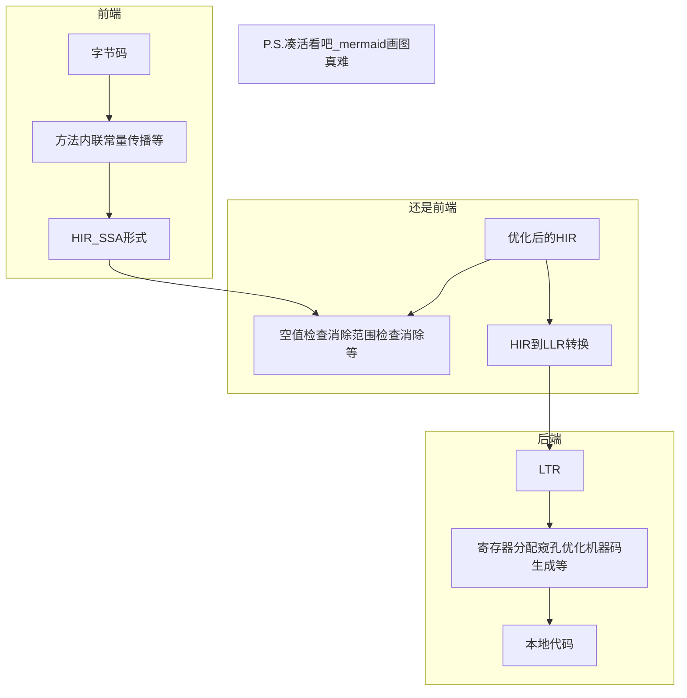

## 11.1 概述

+ 后端的从class到机器码，本来是解释器执行的
+ 当虚拟机发现某个方法或代码块执行频繁时，就把这些**热点代码**编译了，再优化。负责这项任务的就是**即时编译器**

### 11.2.1 解释器与编译器

+ 解释器与编译器各自的优势：
  + 解释器可以迅速启动，编译器随后跟上，提高效率
  + 内存资源限制大时，可以解释执行，反之可以编译
  + 解释器还可以作为编译器激进优化的一个“逃生门”
  + 在整个虚拟机执行架构中，解释器与编译器经常配合工作如下图：

* 注释：
  * 上图中从解释器到编译器有条线：即时编译
  * 从编译器到解释器：逆优化

+ client compiler和server compiler简称为c1编译器或c2编译器，虚拟机默认采用解释器与其中一个编译器配合工作。
+ 三种工作方式：混合模式(自动)，解释模式(编译器不介入)，编译模式(优先采取编译模式)
+ 分层编译：根据编译器编译优化的规模与耗时，划分出不同的编译层次：
  + 第零层：解释执行，解释器不开启性能监控，可触发1层编译
  + 第一层：C1编译，简单优化
  + 第二层：C2编译，大优化，甚至激进优化
  + 分层编译后，C1C2同时工作，代码可能被多次编译

### 11.2.2 编译对象与触发条件

+ 编译对象有两类：
  + 被多次调用的方法
  + 被多次执行的循环体
+ 前者是标准的JIT编译方式，后者也会以整个方法作为编译对象，称为OSR编译(栈帧还在栈上，方法就被替换了)
+ 判断一段代码是否是热点代码，要用热点探测，两种方式
  + 基于采样的热点探测：周期性查看栈顶，经常看到谁在栈顶，就编译它
  + 基于统计的热点探测：维护两个计数器：
    + 方法调用计数器：统计方法被调用的次数，每次gc有半衰期
    + 回边计数器：统计循环体，没有衰减，统计绝对次数

### 11.2.3 编译过程

+ C1和C2的编译过程不同。C1主要关注局部性优化，三段编译：

+ Server Compiler是专门为服务端调整的编译器，充分优化，执行所有经典的优化动作。
+ 它的编译速度远超传统的静态编译器，也比c1编译器输出的代码质量高。

### 11.2.4 查看及分析即时编译效果

+ 大部分跳过
+ Server Compiler的中间代码表示是一种名为Ideal的SSA形式程序依赖图，图中每个方块代表一个程序的基本块，特点是只有唯一的一个入口和唯一的一个出口，只要块中第一条指令执行了，其他指令肯定也会执行一遍